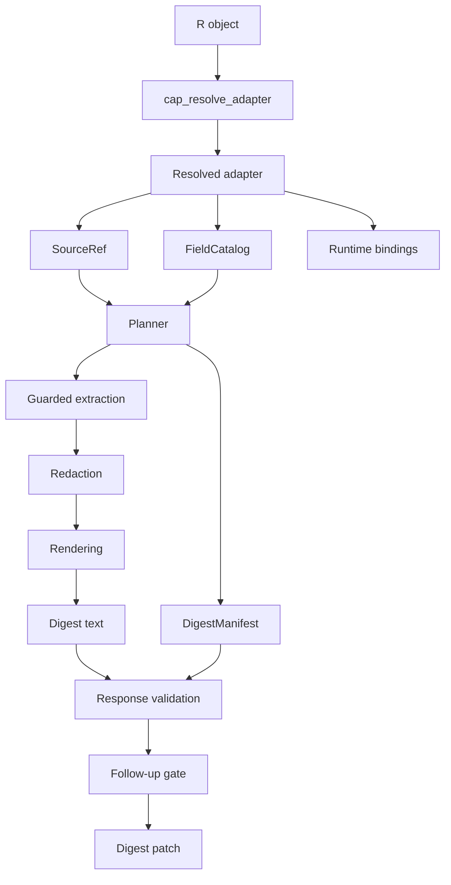

# Architecture Overview

## Logical flow



## Layers

### Host integration

Resolves a concrete R object to one adapter. This is the only layer where host-class polymorphism should be necessary.

### Catalog and planning

Builds a cheap field catalog, expands field levels, applies policy and intent, and records selected and rejected candidates deterministically.

### Materialization

Runs extractor, redactor, and renderer bindings under execution-class guards. The order is fixed:

```text
extract -> redact -> render -> escape -> assemble
```

### Artifact production

Produces canonical CAP artifacts. Implementation-specific provenance is stored separately when the canonical schema has no extension point.

### Validation and follow-up

Validates evidence anchors and requests. The gate, not the model, authorizes additional extraction.

## Boundaries

The initial runtime is a CAP-Digest implementation, not a CAP-Core claim. Local session, cache, registry lock, and run records are capR implementation state. Third-party packages may own semantic adapters, but their adapters do not inherit the built-in table conformance claim.
